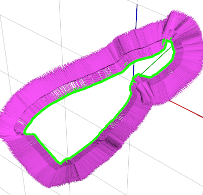

# flowdometry

A dense indirect visual-odometry program for longitudinal velocity using RGBD data.

## Dependencies
- ROS Kinetic
- CUDA

## Installation
This catkin project has been tested on Ubuntu 16.04 running ROS Kinetic and CUDA 8.0.

- The ROS installation is documented [here](http://wiki.ros.org/kinetic/Installation/Ubuntu)

- The CUDA installation and documentation are found [here](https://developer.nvidia.com/cuda-downloads)

Once the above dependencies have been installed, clone this catkin metapackage into your catkin workspaces source directory (here denoted `~/catkin_ws/src`).

```
$ cd ~/catkin_ws/src
$ git clone www.github.com/fulkast/flowdometry
```

Next you may build the catkin project by running:
```
$ cd ~/catkin_ws/
$ catkin_make
```

## Usage
The `flowdometry` ROS node assumes that the same camera is used throughout the lifetime of the program. As such, it is required to fill in the camera intrinsics in the parameters file `flowdometry/config/params.yml`.

The program listens to two ROS messages, one for the RGB image data and another for the depth image data. These can be properly mapped to the corresponding message names on your setup in the file `flowdometry/launch/flowdometry.launch`

In my case, the `RGB` data and `depth` data are mapped to `/left/image_rect_color` and `/depth/depth_registered` respectively as follows:

```
<remap from="rgb" to="left/image_rect_color" />
 ... # remapping other topics

<remap from="depth" to="/depth/depth_registered" />

```

Now what's left is to ensure that your corresponding `RGB` and `Depth` stream sources are active and publishing data. Thereafter, you may launch flowdometry by running:

`$ roslaunch flowdometry flowdometry.launch`

The output of the flowdometry node is the low pass filtered forward longitudinal velocity which is available on the topic `longitudinal_velocity`

## Acknowledgements
This project is heavily dependent on [Karl Pauwel's](http://www.karlpauwels.com/) implementation of phase-based optical flow (robust to photometric errors) in CUDA. He shared the optical flow implementation (`low_level_vision` and `utilities`) in a ROS metapackage for object tracking called [simtrack](https://github.com/karlpauwels/simtrack).

## But Why Just the Longitudinal Velocity?
This project was developed mainly for [diy robocars](https://diyrobocars.com/) a monthly robotics race that takes place in Oakland, CA. The task is for the robot to navigate through a "planar" race track as quickly as possible, staying within marked lane lines.

The detection of the lane lines is sufficient to deduce the position of the vehicle relative to the center lane as well as the planar orientation of the vehicle relative to the reference heading direction, governed by the lanes. It would be great to integrate over time the absolute position of the vehicle on the track, to be able to precisely switch between desired longitudinal speeds. However, without further incorporating place-recognition, the absolute position of the vehicle is unobservable and its error would drift off over time.

As such, it's been decided to (more conservatively) switch between different velocity setpoints, based on the curvature/desired turning angle, as calculated through the lane detection. The longitudinal velocity from this visual odometry module is used for the motor speed control feedback, to arrive at the desired setpoint velocity.

## Typical Error Messages
In the current release, the reduce operation which accumulates optical flow and
depth data used in the calculation of the visual odometry has not been optimized
for the sparsity of the data points (it allocates memory for a lot of redundant pixel
  positions where no optical flow/depth value is available). As such it is likely that
  the program would try to allocate more memory than there is available on your GPU.
  Currently, this problem is handled by reducing the scaling factor, which would reduce the resolution of the images and appropriately rescaling the camera intrinsics (at the cost of lower precision). The scaling parameter is found in `flowdometry/config/params.yml`

## Miscellaneous Visualizations
  
